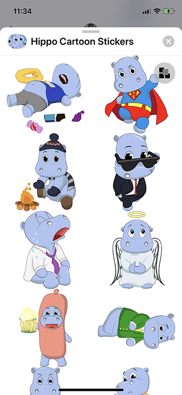

# StickerCollection
Provies collection view for iMessage stickers with sorting (ordering stickers manually) feature.



Its ready to use from the box, all steps are needed:
* Add StickerCollectionView to view hierarchy;
* Assign to this view an object that implements StickerCollectionDataSource (might be just a NSMutableArray);

To save users ordering NSUserDefaults might be used.
Project provides a convenient category to create data source bounded with NSUserDefeaults.
```
[NSUserDefaults.standardUserDefaults stickerCollectionDataSource:^(id<StickerCollectionUserDefaultsComposer> composer) {
    [composer addSticker:@"Angel" extension:@"gif"];
    [composer addSticker:@"Beer" extension:@"gif"];
    ...
}];
```

Collection View uses 'editing' and 'messaging' states.
In 'messaging' users can send stickers as they usually do.
While in 'editing' users are able to manually order stickers by dragging them.

It's recommended to provide a button which will switch between these two states.

Collection View allows to customize stickers layout by providing object that implements StickerCollectionLayout.
In addition at allows to provide custom stickers views, which can implement its own bouncing animation etc.

